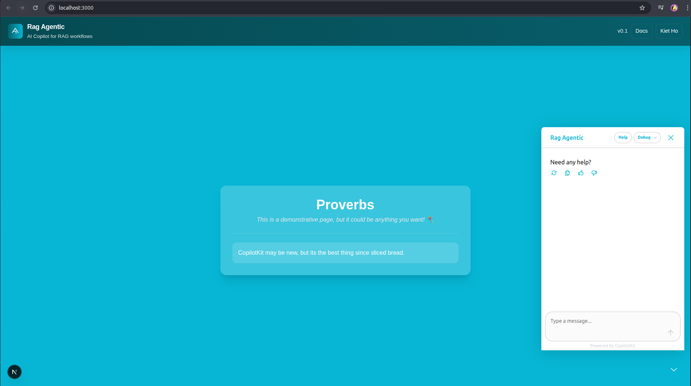

## RAG AGENTIC AI USING PYDANTIC AND COPILOTKIT



This repository is a starter for building AI agents with Pydantic AI and CopilotKit. It contains a Next.js frontend integrated with a Python-based Pydantic AI agent, example tools (Jira, RAG, Web Search) and a supervisor agent pattern for orchestrating multi-tool queries.

## Quick overview

- Frontend: Next.js + CopilotKit components (in `src/app`)
- Agent: Python (Pydantic AI) under `agent/src`
- Supervisor agent: `agent/src/supervisor.py` (orchestrates JIRA, RAG, WebSearch)
- API bridge (optional): `agent/src/supervisor_api.py` exposes a FastAPI endpoint used by the frontend

## Prerequisites

- OpenAI API key (for OpenAI Responses models)
- Python 3.12+
- Node.js 18+ (Node 20 recommended)
- A package manager: pnpm (recommended), npm, yarn, or bun

## Setup (dev)

1. Install frontend dependencies (choose one):

```bash
# pnpm (recommended)
pnpm install

# npm
npm install

# yarn
yarn install

# bun
bun install
```

2. Install Python dependencies for the agent (helper script available):

```bash
# from repository root
cd agent
# create venv if needed
python -m venv env
source env/bin/activate
pip install --upgrade pip
pip install -r requirements.txt || pip install fastapi uvicorn python-dotenv pydantic-ai
```

3. Configure environment variables

Create `agent/.env` (example):

```env
OPENAI_API_KEY=sk-...your-key...
# Optional: change these if your services run on different URLs
JIRA_MCP_URL=http://localhost:9000/mcp
LIGHT_RAG_URL=http://localhost:9621/query
PYTHON_AGENT_URL=http://localhost:8000
```

Create frontend `.env.local` if needed:

```env
NEXT_PUBLIC_PYTHON_AGENT_URL=http://localhost:8000
```

4. Start services

Start the Python agent (FastAPI supervisor API, if used):

```bash
cd agent
source env/bin/activate
python -m uvicorn src.supervisor_api:app --reload --port 8000
```

Start the Next.js frontend:

```bash
# from repo root
npm run dev
# or pnpm dev
```

The frontend will be available at http://localhost:3000 and the supervisor API at http://localhost:8000 (if you started it).

## Important: WebSearchTool (OpenAI)

If you rely on the built-in WebSearchTool with OpenAI, the provider requires the OpenAI Responses model. Ensure your agent uses `openai-responses:gpt-5` (not the regular chat models). Example in `agent/src/agent.py`:

```python
from pydantic_ai import Agent, WebSearchTool
from pydantic_ai.models.openai import OpenAIResponsesModel, OpenAIResponsesModelSettings

agent = Agent(
  model=OpenAIResponsesModel('openai-responses:gpt-5'),
  builtin_tools=[WebSearchTool()],
  model_settings=OpenAIResponsesModelSettings(openai_include_web_search_sources=True),
  # ... other params
)
```

If you don't use OpenAI Responses, WebSearchTool is also supported by Anthropic and Google with caveats (see upstream docs).

## Supervisor agent and frontend integration

- `agent/src/supervisor.py`: supervisor that decides when to call Jira, RAG, or WebSearch and synthesizes results.
- `src/components/supervisor-search.tsx`: example frontend component to render supervisor results (if present).
- `src/app/api/supervisor/route.ts`: Next.js API route that forwards queries to the Python supervisor API.

To use the supervisor from the frontend, the typical flow is:

1. Frontend calls `/api/supervisor` (Next.js) → this forwards to the Python supervisor API at `PYTHON_AGENT_URL`.
2. Python supervisor runs `run_supervisor(...)` which delegates to tool agents and synthesizes results.
3. Results are returned to the frontend and rendered by `SupervisorSearchCard`.

## Testing WebSearch quickly

You can test the web search directly (from the `agent` folder) once your env is configured:

```bash
source env/bin/activate
python -c "from src.agent import agent; print(agent.run_sync('Please use web search: what are the latest AI developments in 2025').output)"
```

Note: If sources don't appear, prefix the prompt with an explicit instruction such as `Please use the built-in web search tool and cite source URLs:` to encourage the model to invoke the builtin tool.

## Scripts (package.json)

The repo includes useful npm scripts (see `package.json`). Common scripts:

- `dev` - run frontend and agent concurrently (project may provide a wrapper)
- `dev:ui` - run only frontend
- `dev:agent` - run only the Python agent
- `install:agent` - install Python deps (if present)

## Troubleshooting

- If the frontend can't reach the Python supervisor, check `NEXT_PUBLIC_PYTHON_AGENT_URL` and `PYTHON_AGENT_URL`.
- If WebSearchTool errors with model support, ensure you're using `openai-responses:gpt-5` and your OpenAI key is set.
- If RAG returns empty results, confirm LightRAG (or your RAG service) is running and indexed.

## Contributing

Contributions welcome — open issues or PRs. Keep changes small and document behavior in the relevant module.

## License

MIT — see the `LICENSE` file.
