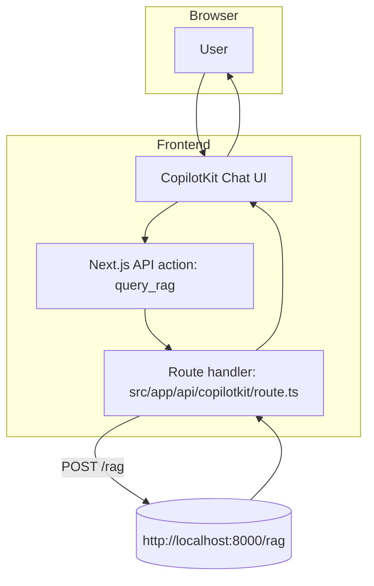
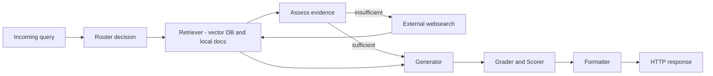
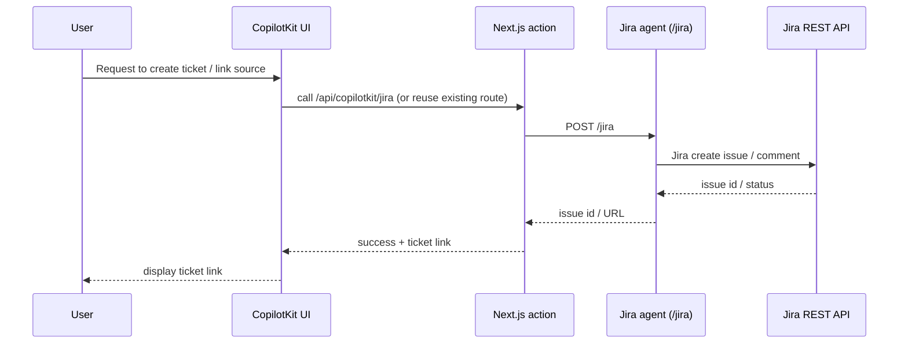
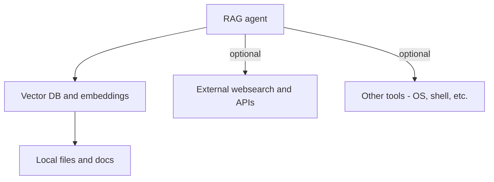

# RAG Agentic — Overview & Run Guide

This repository integrates a RAG-style multi-agent backend (FastAPI + PydanticAI components) with a CopilotKit-powered Next.js frontend. It is designed as a developer starter for testing, extending, and running a RAG assistant locally.

## Table of contents
- Overview
- Architecture
- Components
- Config / env file
- Workflow
- How to start
  - Frontend
  - Backend
- Troubleshooting

## Overview
This project contains two main parts:
- Frontend: a Next.js app using CopilotKit for chat UI and actions (runs on port 3000 by default).
- Backend: a PydanticAI / FastAPI agent server that exposes endpoints (notably `/rag`) used by the frontend to run the RAG flow (runs on port 8000 by default).

The frontend sends user queries to a CopilotKit Action which forwards them to the backend `/rag` endpoint. The backend runs the router/generator/grader/retriever workflow and returns an answer with structured metadata (workflow, scores, sources).

## Architecture

- Next.js (UI)
  - CopilotKit components and an API route at `src/app/api/copilotkit/route.ts`
  - Single-page chat interface at `src/app/page.tsx`
- FastAPI (Agent)
  - Located under the `agent/` folder
  - Main agent endpoint: `POST /rag`
  - Agent composed of: Router, Retriever, Generator, Grader

Communication:
1. Browser → Next.js Copilot UI
2. Copilot Action (`query_rag`) → Next.js API route `/api/copilotkit/route.ts`
3. Next.js API → Backend `http://localhost:8000/rag`
4. Backend returns answer string with appended metadata (workflow, scores, sources)

## Components

- Frontend (Next.js + CopilotKit)
  - `src/app/page.tsx` — chat UI
  - `src/app/api/copilotkit/route.ts` — action handler for `query_rag`
  - `src/app/globals.css` — styling for chat and metadata

- Backend (agent/)
  - `agent/src/rag_agent.py` (core RAG orchestration and formatting)
  - `agent/src/main.py` (FastAPI entrypoint)
  - `agent/pyproject.toml` (python packaging / dependencies)
  - `scripts/` — helper scripts to start/setup the agent

## Config / env file

Create a `.env` file in the `agent/` folder (or export environment variables) with at least the following:

```
# Required for model calls
OPENAI_API_KEY=sk-...your-openai-key-here...

# Optional provider / monitoring keys used in this repo
TAVILY_API_KEY=tvly-...optional...
LOGFIRE_TOKEN=logfire-...optional...

# Agent server port (default 8000)
AGENT_PORT=8000

```

Notes:
- The frontend expects the agent to be accessible at `http://localhost:8000/rag` by default. If you change the port or host, update the action in `src/app/api/copilotkit/route.ts`.

## Workflow (high level)

This repository runs two cooperating agents:

- Jira agent — handles ticket creation, updates, and querying Jira for issue state.
- RAG agent — answers technical/support queries using internal documents and external web search when needed.

ASCII fallback (if Mermaid is not rendered):

User -> Next.js UI (CopilotKit) -> Next.js API action `query_rag` -> RAG agent (/rag)
  RAG agent -> Internal docs (vector DB / local docs)
  RAG agent -> [optional] External websearch / tools
  RAG agent -> Generator / Grader -> returns answer+metadata -> UI

Jira interactions (separate):
- User can trigger Jira actions from the UI (e.g., create ticket, link source).
- UI -> Jira agent (/jira) -> Jira API -> UI (ticket id, status)

Responsibilities (short):

- RAG agent:
  - Primary: answer technical/support questions using internal docs.
  - Secondary: call external websearch tools when local docs are insufficient.
  - Returns: answer text + structured metadata (workflow, scores, numbered sources).

- Jira agent:
  - Manage issues (create, update, comment, query status) in Jira.
  - Provide ticket links and IDs so the RAG agent or UI can reference them.

Notes:
- The RAG agent decides its strategy (LOCAL_ONLY, WEB_AUGMENT, etc.) at runtime based on retrieved evidence.
- The frontend currently uses a CopilotKit action that forwards queries to `/rag`. If you want the UI to also talk to `/jira`, add an action for Jira tasks that calls `http://localhost:8000/jira`.


## How to start

Prereqs: Node.js (v20+), Python 3.12+, git

### Start both frontend + backend (recommended)

From repo root you can start both concurrently (this repo includes a convenient script):

```bash
# install JS deps
npm install

# install python deps and agent setup (postinstall runs install:agent automatically on npm install)
npm run dev
```

This `dev` script runs both the UI and agent (it uses `concurrently`).

### Start frontend only

```bash
# from repo root
npm install
npm run dev:ui
# UI will be available at http://localhost:3000
```

### Start backend (agent) only

```bash
cd agent
# create venv and activate (Linux/macOS)
python3 -m venv .venv
source .venv/bin/activate

# install dependencies (if a requirements.txt exists; otherwise use pyproject or the helper script)
pip install -r requirements.txt || pip install -e .

# set env vars (example)
export OPENAI_API_KEY=sk-...your-key...
export TAVILY_API_KEY=tvly-...optional...

# run the agent
python src/main.py

or 

~/RAG-agent/rag-agentic-pydantic-ai/agent/.venv/bin/python3 ~/RAG-agent/rag-agentic-pydantic-ai/agent/src/main.py

# or use the provided script from repo root
./scripts/run-agent.sh
```

After starting the agent, verify it's reachable:

```bash
curl http://localhost:8000/health
```

Create frontend `.env.local` if needed:

```env
NEXT_PUBLIC_PYTHON_AGENT_URL=http://localhost:8000

## Troubleshooting

- If the frontend doesn't show sources or metadata:
  - Confirm the backend is running on port 8000 and `/rag` responds.
  - Confirm `src/app/api/copilotkit/route.ts` points to the correct backend URL.

- If responses are being rephrased or metadata removed by the assistant model:
  - The app sends a single answer string with the metadata appended. Ensure Copilot action is returning the raw response (the action handler returns the backend string without additional post-processing).

- Common env issues:
  - `OPENAI_API_KEY` incorrect or missing → model calls fail.
  - Network/port mismatch between frontend and agent → CORS or connection errors.

## Notes & Next steps

- You can customize formatting of the metadata block in `agent/src/rag_agent.py` (where the answer string is assembled) and the frontend rendering styles in `src/app/globals.css`.
- If you want richer metadata rendering (e.g., clickable source cards), update the CopilotKit message rendering in the frontend — currently the backend returns Markdown-like sections that the chat UI renders as text/HTML depending on CopilotKit configuration.
- If you want richer metadata rendering (e.g., clickable source cards), update the CopilotKit message rendering in the frontend — currently the backend returns Markdown-like sections that the chat UI renders as text/HTML depending on CopilotKit configuration.

## Component diagrams (detailed)

Below are component-level diagrams (Mermaid + ASCII fallback) that describe the workflows for each major part of the system: Frontend, RAG internals, Jira agent, and Data & Tools.

### 1) Frontend (Next.js + CopilotKit)

Mermaid:



ASCII fallback:

User -> CopilotKit UI -> Next.js action (`query_rag`) -> route handler -> Backend `/rag` -> route returns response -> UI -> User

Notes:
- The frontend handles user input, triggers an action, and displays the returned answer + metadata. If you add Jira actions, a similar action route can be used to call `/jira`.

---

### 2) RAG agent internals (Router, Retriever, Generator, Grader)

Mermaid (fixed):



ASCII fallback:

Query -> Router -> Retriever -> Evaluate evidence
  If sufficient -> Generator -> Grader -> Formatter -> Response
  If insufficient -> External websearch -> Retriever -> Generator -> Grader -> Formatter -> Response

Notes:
- Router chooses a strategy (LOCAL_ONLY, WEB_AUGMENT, etc.) based on evidence and temporal/recency needs.
- Retriever queries the internal vector DB / local documents. If needed, the agent calls external tools (websearch) and re-runs retrieval.
- Generator uses model completion to draft the answer; Grader computes relevancy/faithfulness/quality scores. Formatter packages the answer and a numbered sources list.

---

### 3) Jira agent (ticket management)

Mermaid:



ASCII fallback:

User -> UI -> Next.js API -> Jira agent -> Jira REST API -> Jira agent -> Next.js API -> UI -> User

Notes:
- The Jira agent is a separate endpoint under the same FastAPI app (e.g., `POST /jira`). The front-end can call it via a dedicated CopilotKit action route.

---

### 4) Data & Tools (Vector DB, Files, Websearch)

Mermaid:



ASCII fallback:

RAG agent <-> Vector DB (embeddings) <-> Local files/docs
RAG agent -> [optional] External websearch or other tools

Notes:
- The vector DB contains embeddings derived from local docs. The Retriever queries it to pull relevant passages. External websearch is used only when the router or retriever indicates local evidence is insufficient.

